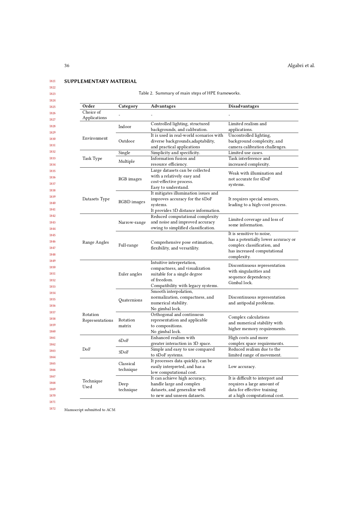
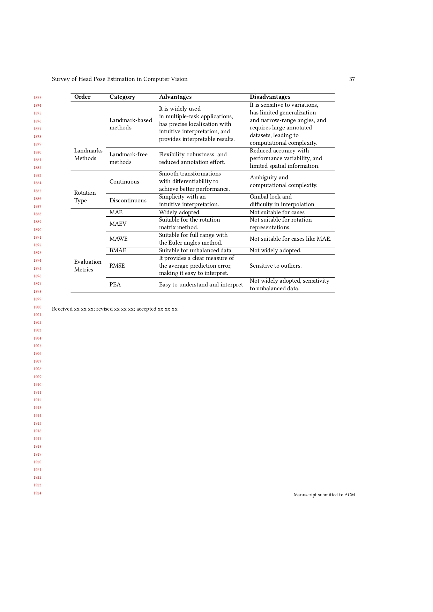
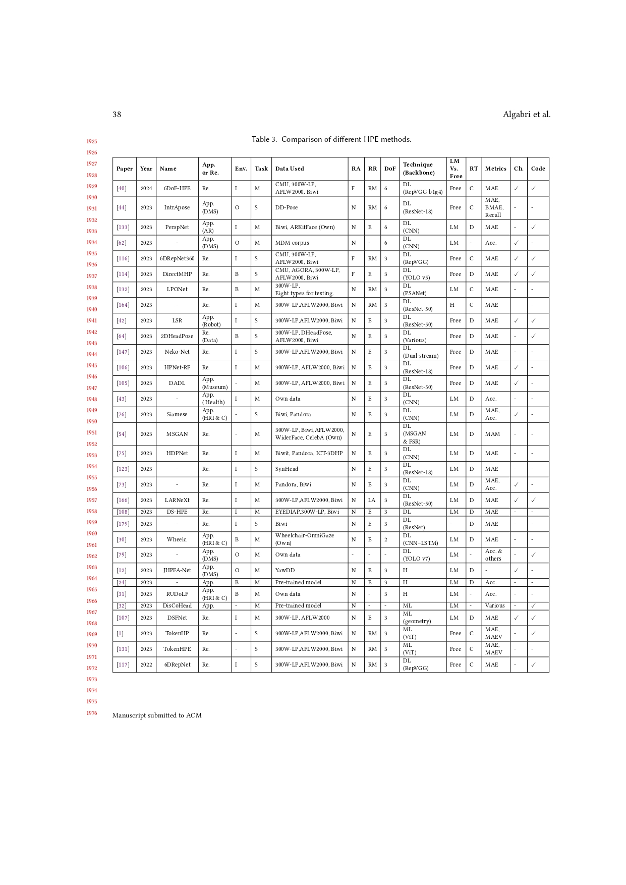
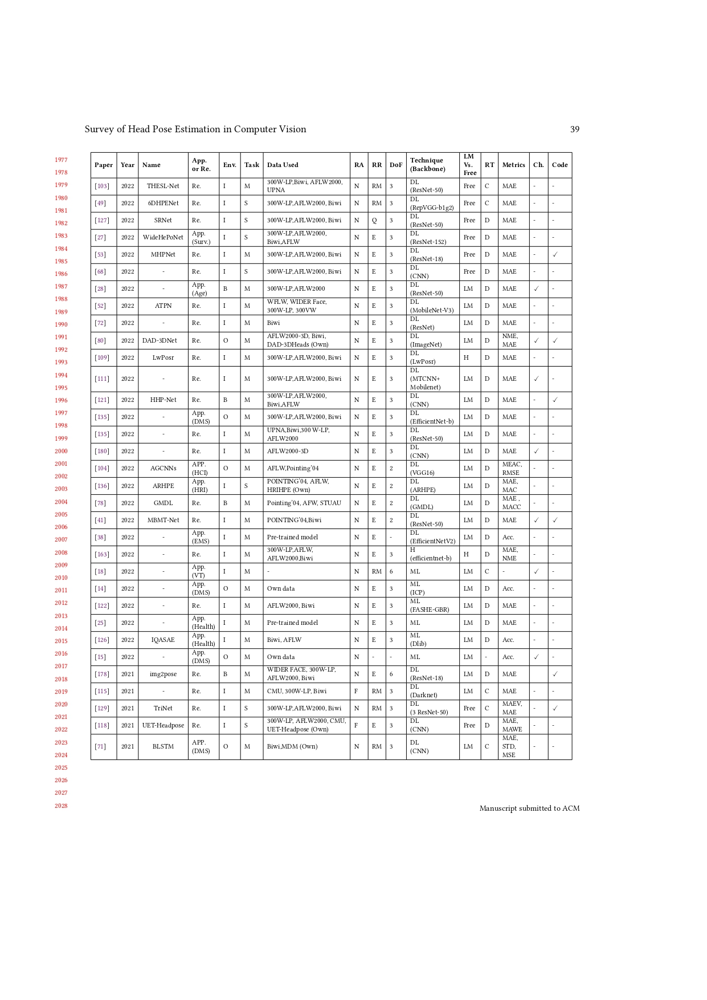
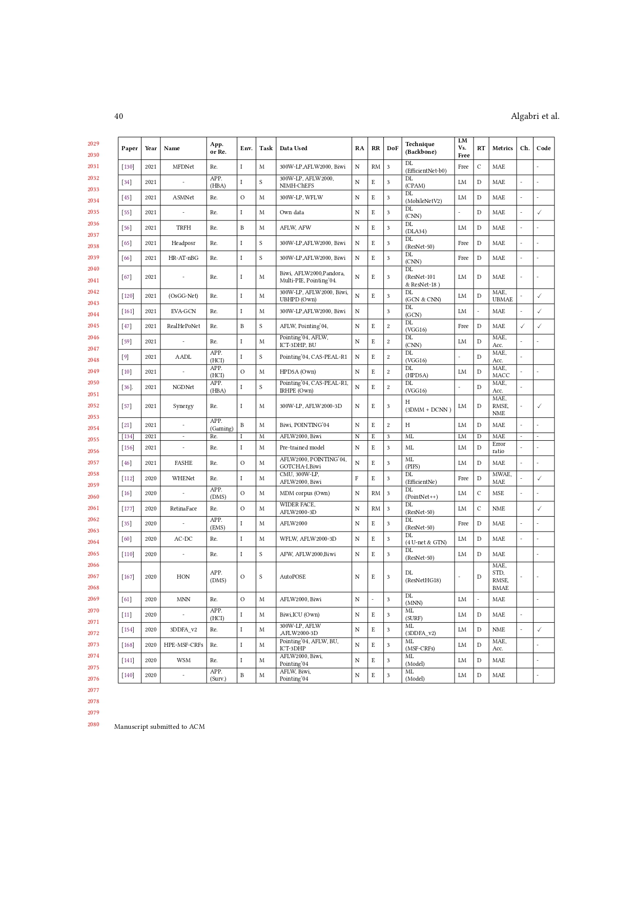
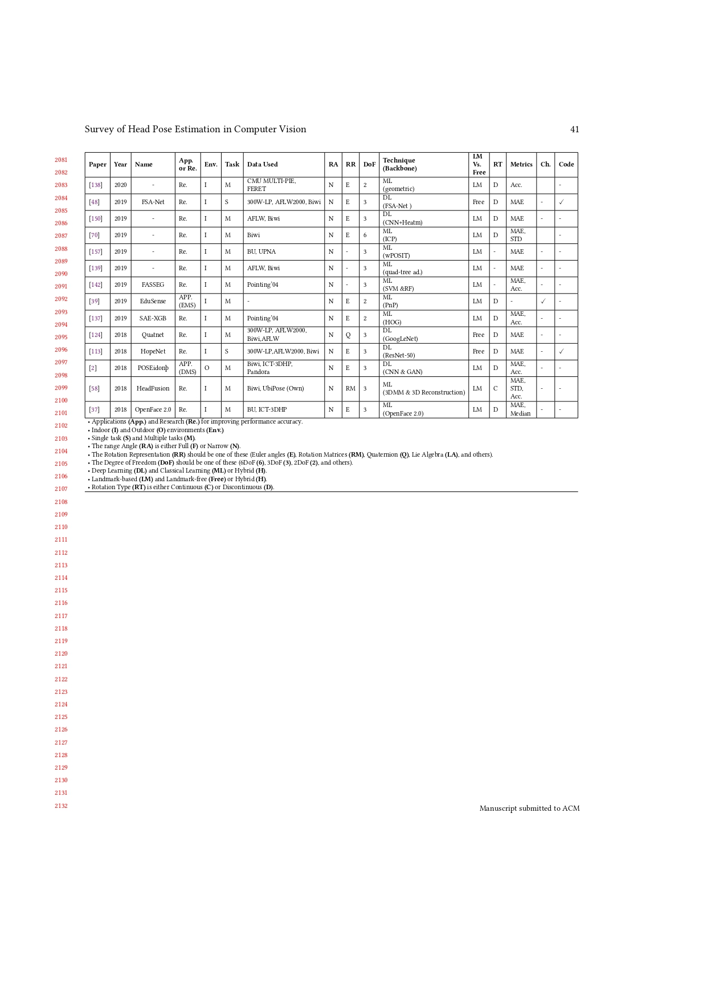
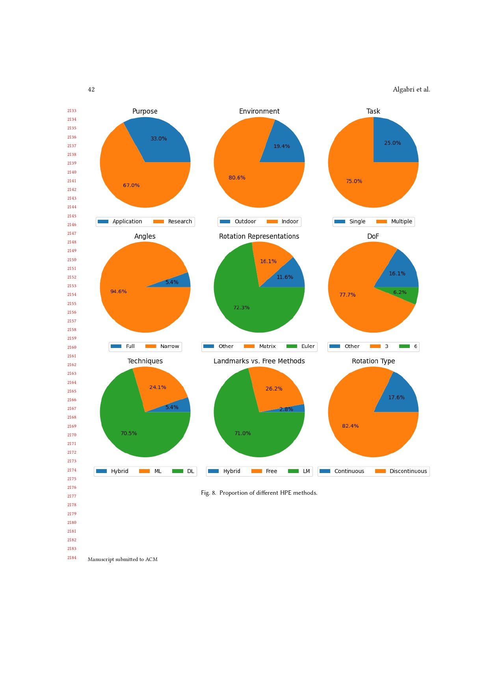
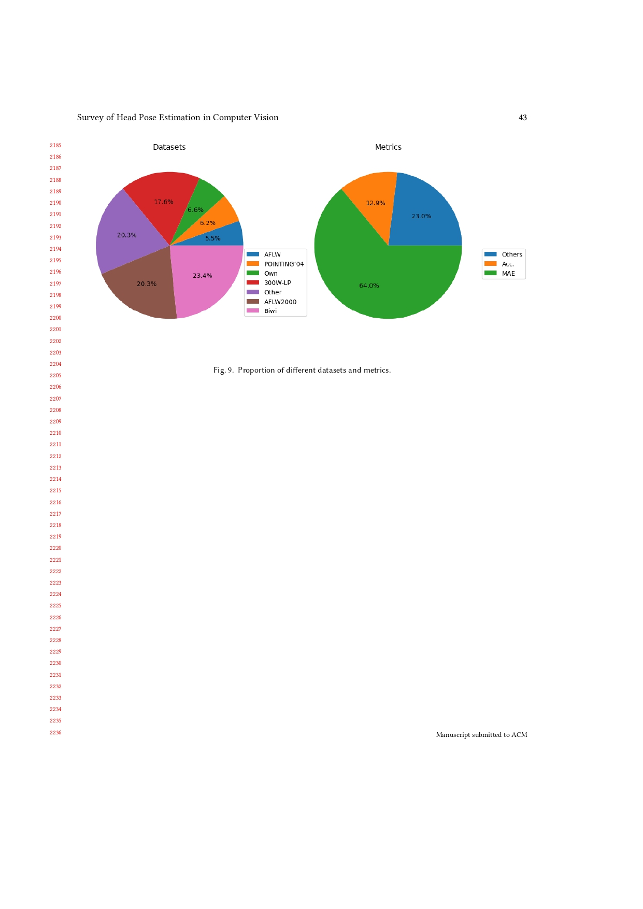

**Note:** All papers, datasets, and their links will be here when our manuscript gets accepted.
# Journal Papers

**list (2024)**

**list (2023)**

1. Asymmetry-aware bilinear pooling in multi-modal data for head pose estimation [[Paper](https://www.sciencedirect.com/science/article/pii/S0923596522001746)]

**list (2022)**

**list (2021)**

**list (2020)**

**list (2019)**

**list (2018)**

**...**

**...**

**...**

# Conferences Papers
**list (2024)**

**list (2023)**
1. TokenHPE: Learning Orientation Tokens for Efficient Head Pose Estimation via Transformers [[paper](https://openaccess.thecvf.com/content/CVPR2023/papers/Zhang_TokenHPE_Learning_Orientation_Tokens_for_Efficient_Head_Pose_Estimation_via_CVPR_2023_paper.pdf)]

2. Hands-free Mobile Device Control Through Head Pose Estimation [[paper](https://ieeexplore.ieee.org/stamp/stamp.jsp?tp=&arnumber=10150384)]

3. DisCoHead: Audio-and-Video-Driven Talking Head Generation by Disentangled Control of Head Pose and Facial Expressions [[paper](https://ieeexplore.ieee.org/abstract/document/10095670)]

**list (2022)**

**list (2021)**

**list (2020)**

**list (2019)**

**list (2018)**

**...**

**...**

**...**

# Preprint Papers

**list (2024)**

**list (2023)**

1. A Simple Baseline for Direct 2D Multi-Person Head Pose Estimation with Full-range Angles  [[paper](https://arxiv.org/pdf/2302.01110.pdf)]

2. Towards Robust and Unconstrained Full Range of Rotation Head Pose Estimation [[paper](https://arxiv.org/pdf/2309.07654.pdf)

**list (2022)**

**list (2021)**

**list (2020)**

**list (2019)**

**list (2018)**

**...**

**...**

**...**

# Books

# SUPPLEMENTARY MATERIAL

**Note:** We will convert these tables from images to texts after acceptance.

